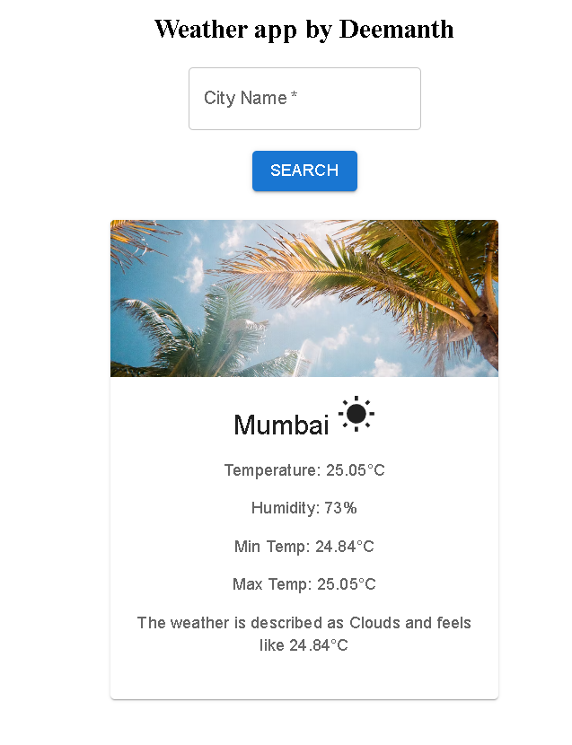
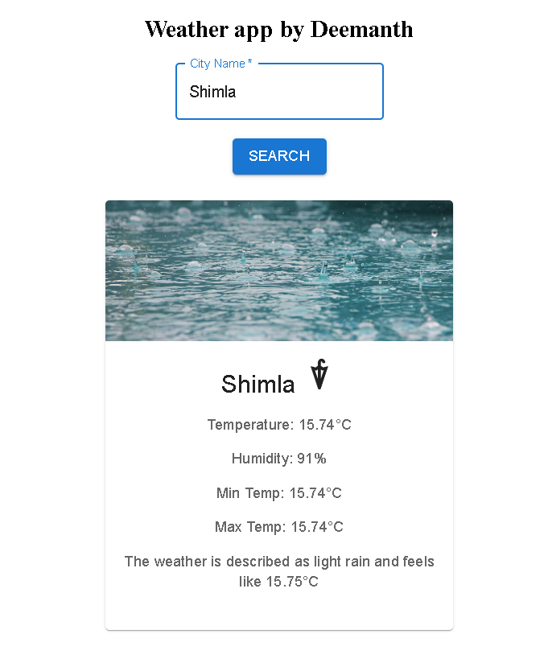
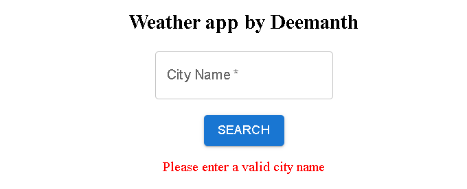
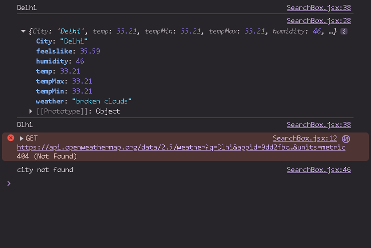

# SkyCast 🌦️ – React Weather App

A responsive weather application built with React that allows users to search weather details by city.  
It fetches real-time data from the OpenWeather API and displays temperature, humidity, min/max temperature, feels like temperature, and a dynamic weather image based on conditions.

---

## 🚀 Features
- 🌍 Search weather by city name
- 🌦️ Display temperature, humidity, min/max, and feels like values
- 🖼️ Dynamic weather image/icons based on conditions (sunny, cloudy, rainy, etc.)
- 📱 Responsive design for desktop and mobile
- ⚡ Built with React hooks for state management

---

## 🛠️ Tech Stack
- **Frontend:** React.js, CSS, Material UI
- **API:** OpenWeather API
- **Deployment:** Netlify / Vercel (optional)

---

## 📸 Screenshots

### 🏠 Homepage

### 🔍 Search Result

### ❌ Invalid City Error

### 🐞 Console Error Handling

## 🔧 Installation

Follow these steps to run the project locally:

1. **Clone the repository**
   bash
   git clone https://github.com/Deemanthyadav74833/SkyCast-React-Weather-App.git
   

2. **Navigate into the project directory**
   bash
   cd SkyCast-React-Weather-App

3. **Install dependencies**
    bash
    npm install

4. **Add your OpenWeather API key**
    Create a .env file in the project root
    Add this line inside it:

    text
    REACT_APP_WEATHER_API_KEY=your_api_key_here

5. **Start the development server**
    bash
    npm run dev

6. **Open the app in Your browser**
    Navigate to http://localhost:5173

## 📝 Usage
Enter a city name in the search box

Press Enter or click the search button

View current weather conditions for that location

The app will display temperature, humidity, and other weather details

The background image will change based on current weather conditions

## 🌐 API Reference
This app uses the [OpenWeather API](https://openweathermap.org/api) to fetch weather data.. You'll need to sign up for a free API key to use the application.

## 🤝 Contributing
Contributions, issues, and feature requests are welcome! Feel free to check the issues page.

## 📄 License
This project is open source and available under the MIT License.

## 👨‍💻 Author
- **[Deemanth Yadav](https://github.com/Deemanthyadav74833)** - GitHub Profile

## 🙏 Acknowledgments

OpenWeather for providing the weather API

React team for the amazing framework

Material UI for the component library
